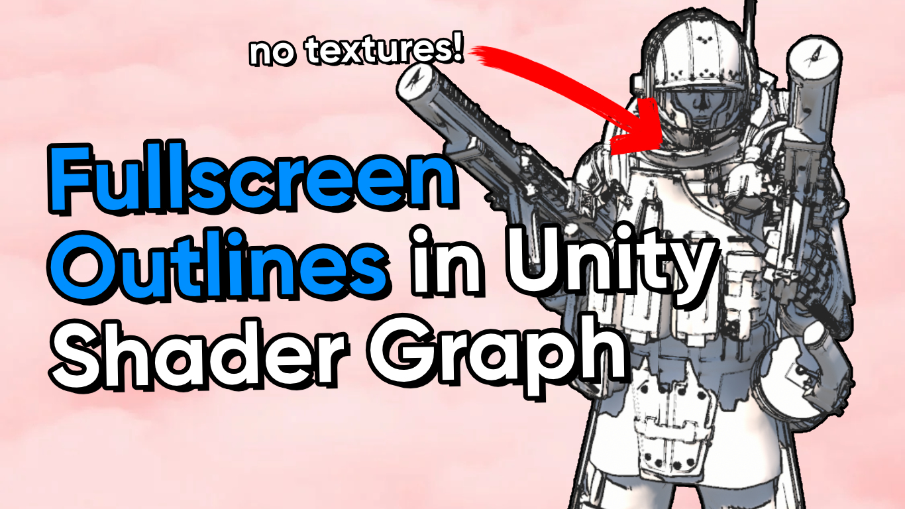

# Outline Post Process in Unity Shader Graph (URP)

A post-processing shader to add thin outlines to objects in Unity URP via Shader Graph.

## Overview

Unity 2022.2 (and the eventual 2022 LTS release of Unity) support the new Fullscreen Shader Graph, which can be used to apply post processing effects to scenes. This repository includes an outline post processing shader and a test scene which shows off the shader.

## Software

This project was created using Unity 2022.2.0f1 (Tech Stream) and URP 14.0.6. There may be changes between this version and the next LTS version of Unity.

## Tutorials

This project is part of a tutorial which is available in the following places:

- [https://www.youtube.com/watch?v=VGEz8oKyMpY](https://www.youtube.com/watch?v=VGEz8oKyMpY)
- [https://danielilett.com/2023-03-21-tut7-1-fullscreen-outlines/](https://danielilett.com/2023-03-21-tut7-1-fullscreen-outlines/)

## Authors

This project and the corresponding tutorials were created by Daniel Ilett.

## Release

This project was released on March 21st 2023.
